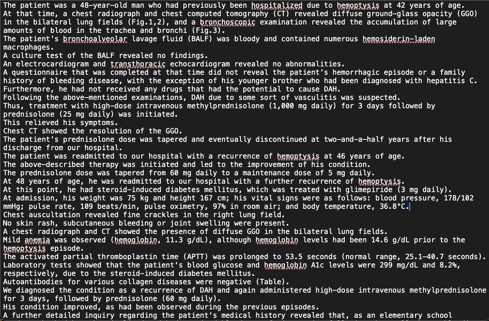
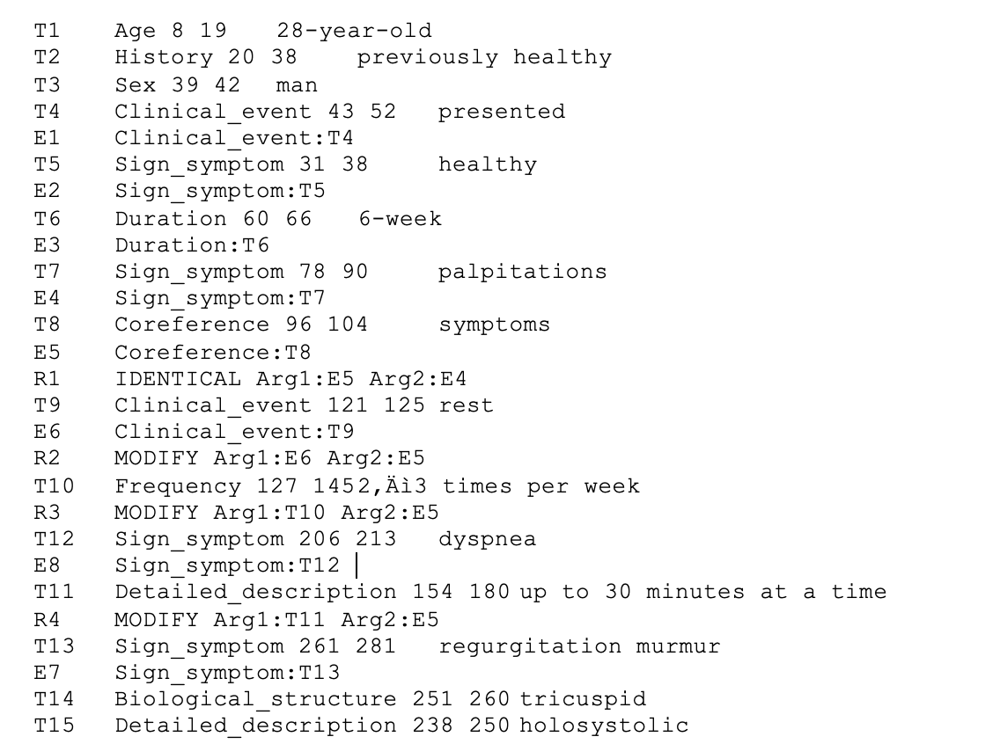

# MedTextNer
Экспериментальные модели для извлечения именнованных сущностей из текстов медицинской тематики

## Dataset
В качестве датасета используется MACCROBAT2020, который состоит из текстовых файлов в формате ".txt" и аннотаций формата ".ann".
### Пример текстого файла

### Пример файла с аннотацией
